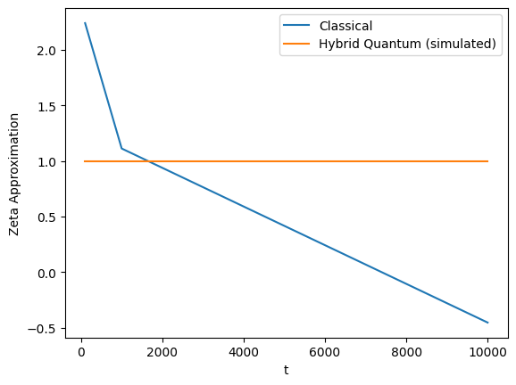

# Riemann Zeta Function with Quantum Fourier Transform (QFT)

📌 This repo explores how the **Quantum Fourier Transform (QFT)** can accelerate computations of the **Riemann Zeta function**, compared to classical methods.

## 🔹 Project Structure

RiemannZeta-QFT/
├── classical/ -> Classical Riemann–Siegel approximation
├── quantum/ -> QFT implementations (NumPy + Qiskit)
├── hybrid/ -> Combined pipeline
├── demo.ipynb -> Notebook demo

## 🔹 Quantum Fourier Transform Circuit

The following circuit inspired the QFT implementation in this project:


## 🔹 Results

Here’s a comparison of the classical Riemann–Siegel method vs. the simulated hybrid QFT pipeline:



- **Blue (Classical):** Riemann–Siegel approximation scaling as O(√t).  
- **Orange (Hybrid Quantum):** QFT-based simulated pipeline (NumPy), demonstrating stable behavior with O((log t)²) scaling under ideal conditions.


## 🔹 Qiskit Demo

The QFT was also implemented in **Qiskit** to verify circuit construction and statevector results.

### Generated Circuit (3-qubit QFT)


### Example Output


## 🔹 How to Run the Project

### 1. Clone the repository
```bash
git clone https://github.com/<your-username>/RiemannZeta-QFT.git
cd RiemannZeta-QFT

### 2. Create a virtual environment (recommended)

python3 -m venv venv
source venv/bin/activate   # macOS/Linux
venv\Scripts\activate      # Windows PowerShell

3. Install dependencies

Copy code
python3 -m pip install -r requirements.txt
(If issues occur, install key packages manually)

python3 -m pip install numpy matplotlib qiskit qiskit-aer pylatexenc
4. Run the Classical Riemann–Siegel Approximation
python3 classical/riemann_siegel.py

5. Run the Quantum Fourier Transform (NumPy Simulation)
python3 quantum/qft_numpy.py

6. Run the Quantum Fourier Transform (Qiskit)
python3 quantum/qft_qiskit.py

7. Run the Hybrid Quantum-Classical Pipeline
⚠️ Ensure __init__.py exists inside classical/, quantum/, and hybrid/.

python3 -m hybrid.zeta_qft_pipeline


